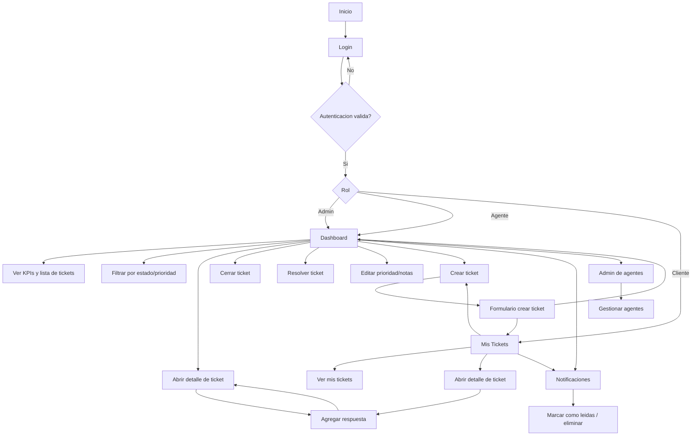

# TicketFlow - Sistema de Gestión de Tickets

## Descripción

TicketFlow es una aplicación web moderna para la gestión de tickets de soporte técnico, desarrollada con React 18, Tailwind CSS y React Query.

## Instalación y Ejecución
```bash
git clone https://github.com/Inigo1405/TicketFlow-Frontend.git
cd TicketFlow-Frontend
npm install
cp .env.example .env.local
npm run dev
```

Nota: ajusta `VITE_API_BASE_URL` en `.env.local` para apuntar a tu backend (usar HTTPS en producción).

## Características

- **Gestión de tickets**: Crear, leer, actualizar y cerrar tickets
- **Dashboard con KPIs**: Visualización de métricas en tiempo real
- **Filtros avanzados**: Filtrar por estado y prioridad
- **Notificaciones**: Sistema de notificaciones en tiempo real
- **Manejo de errores**: Banners de error para 503, timeout y errores de red
- **Validación de formularios**: Validación en tiempo real con mensajes claros
- **Diseño responsivo**: Compatible con móviles y escritorio

## Estructura del Proyecto

```
src/
├── components/
│   ├── Navbar.jsx          # Barra de navegación
│   ├── Badge.jsx           # Componente de etiquetas
│   ├── Button.jsx          # Componente de botones
│   ├── Input.jsx           # Componente de inputs
│   ├── LoadingSpinner.jsx  # Spinner de carga
│   ├── Table.jsx           # Componente de tabla
│   ├── Toast.jsx           # Notificaciones toast
│   ├── BannerError.jsx     # Banners de error globales
│   └── EmptyState.jsx      # Estados vacíos
├── contexts/
│   └── AuthContext.jsx     # Contexto de autenticación
├── layouts/
│   ├── AuthLayout.jsx      # Layout para páginas de autenticación
│   └── MainLayout.jsx      # Layout principal
├── pages/
│   ├── Login.jsx           # Página de inicio de sesión
│   ├── Dashboard.jsx       # Dashboard principal
│   ├── CreateTicket.jsx    # Crear nuevo ticket
│   └── Alerts.jsx          # Página de notificaciones
├── services/
│   └── api.js              # Cliente HTTP con interceptores
├── App.jsx                 # Configuración del router
└── main.jsx                # Punto de entrada
```

## Componentes UI

### Badge
Componente de etiquetas para mostrar estados y prioridades.

```jsx
<Badge type="status">Abierto</Badge>
<Badge type="priority">Alta</Badge>
```

### Button
Componente de botones con variantes y tamaños.

```jsx
<Button variant="primary">Guardar</Button>
<Button variant="secondary">Cancelar</Button>
<Button variant="danger">Eliminar</Button>
```

### Table
Tabla reutilizable con columnas personalizadas.

```jsx
<Table
  columns={[
    { key: 'id', label: 'ID', render: (item) => item.id },
    { key: 'title', label: 'Título', render: (item) => item.title },
  ]}
  data={tickets}
/>
```

### Toast
Notificaciones emergentes.

```jsx
<Toast type="success" message="Ticket creado exitosamente" />
```

### BannerError
Banners de error globales para errores de servidor.

```jsx
<BannerError
  type="error"
  message="Error al cargar los tickets"
/>
```

### EmptyState
Estados vacíos para cuando no hay datos.

```jsx
<EmptyState
  type="default"
  title="No hay tickets"
  description="Aún no has creado ningún ticket"
/>
```

## Flujo de Trabajo

### 1. Crear Ticket
1. Navegar a `/create-ticket`
2. Rellenar el formulario con título y descripción
3. Seleccionar prioridad y categoría
4. El ticket se crea y se redirige al dashboard

### 2. Dashboard
1. Ver KPIs de tickets (total, abiertos, resueltos, cerrados)
2. Filtrar por estado y prioridad
3. Cerrar tickets directamente desde la tabla
4. Crear nuevos tickets desde el dashboard

### 3. Notificaciones
1. Ver notificaciones en `/alerts`
2. Marcar como leídas individual o todas
3. Eliminar notificaciones


## Diagrama de flujo


## Manejo de Errores

El interceptor de API maneja automáticamente:

- **401**: Redirección a login (sesión expirada)
- **403**: Mensaje de acceso denegado
- **404**: Mensaje de recurso no encontrado
- **422**: Mensaje de validación fallida
- **429**: Mensaje de rate limiting
- **500-599**: Mensaje de error del servidor
- **Timeout**: Mensaje de tiempo de espera
- **Network**: Mensaje de error de red

## Variables de Entorno

Crea un archivo `.env` en la raíz:

```env
VITE_API_BASE_URL=http://localhost:3000/api
```

## Tecnologías

- **React 18**: Framework UI
- **React Query**: Gestión de estado del servidor
- **Tailwind CSS**: Estilos utilitarios
- **Axios**: Cliente HTTP
- **React Router**: Navegación

## Licencia

MIT


## Equipo de Desarrollo
- **Iñigo Quintana Delgadillo** - [Inigo1405](https://github.com/Inigo1405)
- **Pablo Urbina Macip** - [Puma120](https://github.com/Puma120)
- **David André Acosta Avila** - [spygon9](https://github.com/spygon9)
- **Marco Uriel Castañeda Avila** - [Marco0812](https://github.com/Marco0812)